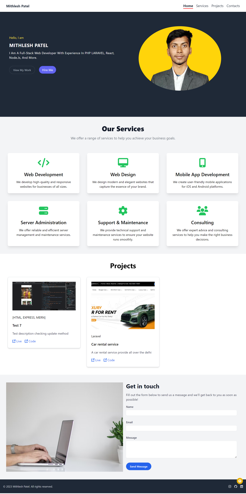

# My MERN Stack Portfolio App

Welcome to my personal portfolio website built using the MERN (MongoDB, Express, React, Node.js) stack. This project showcases my skills as a web developer and provides an overview of my projects and experience.

## Features

- **Responsive Design:** The portfolio is designed to work seamlessly across various screen sizes and devices.

- **Project Showcase:** Highlighting my recent web development projects, complete with descriptions, technologies used, and links to the live demos or GitHub repositories.

## About Me

I'm a dedicated Full Stack Developer with a strong foundation in both frontend and backend technologies. My journey started as a freelancer where I gained hands-on experience working with various clients on diverse projects. This gave me the opportunity to understand the real-world challenges of web development.

With a keen eye for design, I specialize in crafting responsive and user-friendly interfaces using technologies like HTML, CSS, Bootstrap, and Tailwind CSS. On the backend, I'm proficient in building robust APIs and web services using technologies like Node.js and Express.

## Skills

Here's a snapshot of my skill set:

- **Frontend:** HTML, CSS, JavaScript, Bootstrap, Tailwind CSS, React
- **Backend:** Node.js, Express
- **Languages:** C, C++, PHP
- **Frameworks:** Laravel
- **Database:** MongoDB, MYSQL

## Projects

- **Project 1:** [Project Title](https://github.com/your-username/project1) - A brief description of the project.
- **Project 2:** [Project Title](https://github.com/your-username/project2) - A brief description of the project.
- ...

## Contact

I'm open to collaborations, freelance opportunities, and connecting with fellow developers. Feel free to reach out to me via email at `techie.mithlesh@gmail.com` or connect with me on [LinkedIn](https://www.linkedin.com/in/mithlesh-12/).

## Installation & Usage

For instructions on installing and running the app locally, please refer to the [Installation Guide](./installation-guide.md).

## License

This project is licensed under the [MIT License](LICENSE).

---

Let's connect and create amazing web experiences together!

- **Contact:** A way for visitors to get in touch with me. Whether it's about potential collaborations, job opportunities, or just to say hello!

## Technologies Used

- Frontend: React, JavaScript, HTML, CSS
- Backend: Node.js, Express.js
- Database: MongoDB (or your preferred database)
- Deployment: [DigitalOcean](https://www.digitalocean.com/)

## Installation

1. Clone the repository: `https://github.com/techiemithlesh/mern.git`
2. Navigate to the project directory: `cd your-portfolio`
3. Install dependencies for both frontend and backend:

4. Configure environment variables:
- Create `.env` file in the `client` folder for frontend variables (e.g., `REACT_APP_API_URL` for backend API URL).
- Create `.env` file in the `server` folder for backend variables (e.g., `PORT` for the server port).

## Usage

1. Start the backend server:
2. Start the frontend development server:
3. Open your browser and navigate to `http://localhost:3000` to see your portfolio app in action.

## Deployment

- Frontend: Deploy the React app on platforms like [Netlify](https://www.netlify.com/) or [Vercel](https://vercel.com/).
- Backend: Deploy the Node.js app on your [DigitalOcean](https://www.digitalocean.com/) Droplet.

Remember to set up the appropriate environment variables in your deployment environment.

## Contributions

Contributions, issues, and feature requests are welcome! Feel free to open a pull request.

## License

This project is licensed under the [MIT License](LICENSE).

---

Feel free to reach out to me at `techie.mithlesh@gmail.com` or connect with me on [LinkedIn](https://www.linkedin.com/in/mithlesh-12/)!
